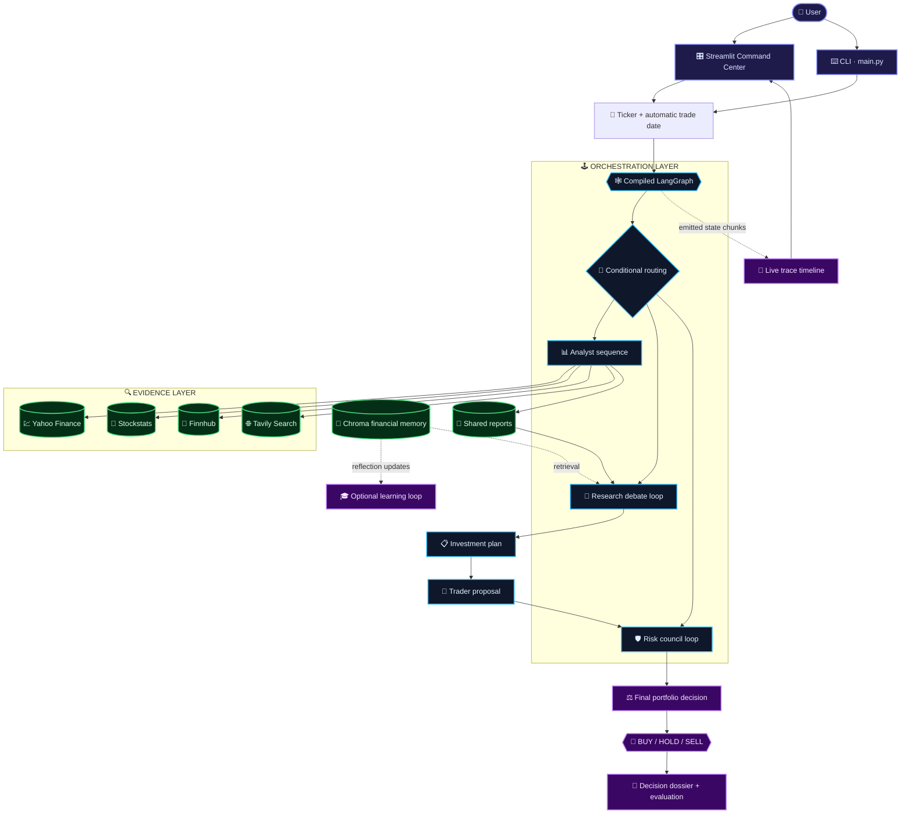
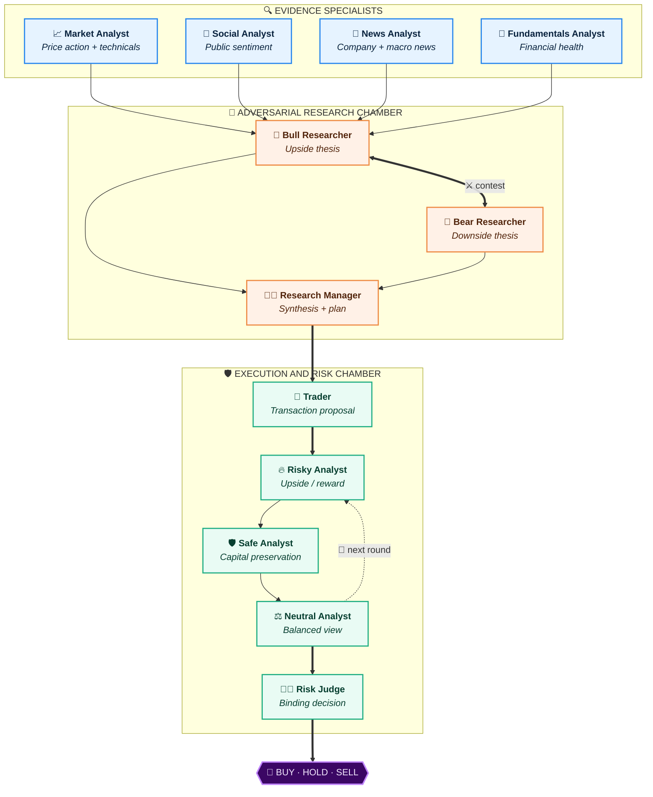
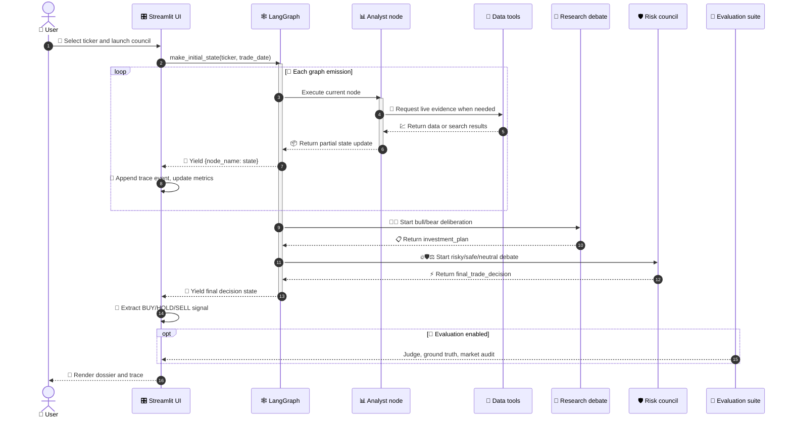
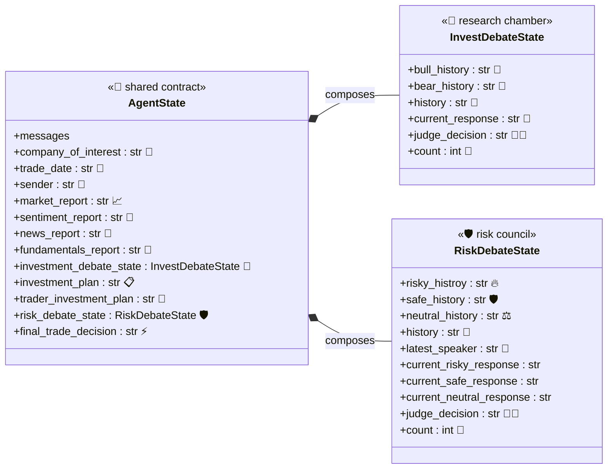
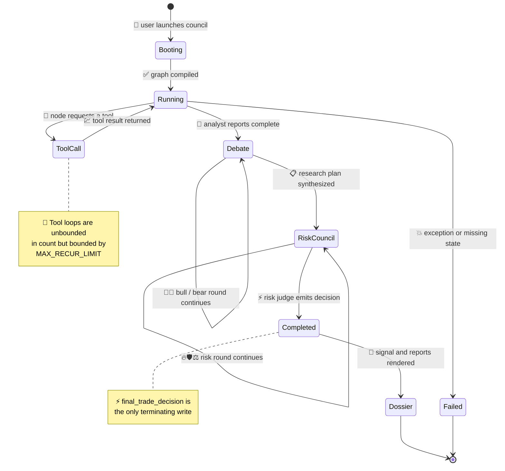
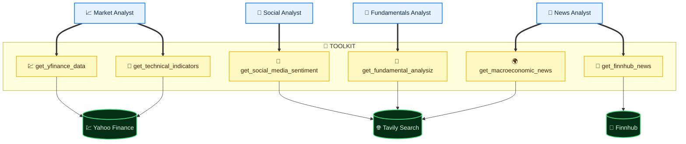

<div align="center">

# ⚖️ QUORUM

### 🧠 Adversarial Multi-Agent Deliberation for Financial Reasoning

*Four analysts gather evidence. Two researchers go to war over it.*
*A trader turns the verdict into a plan. A risk council tears the plan apart.*
*Only then does a decision exist.*

<br/>

[](https://www.python.org/)
[](https://langchain-ai.github.io/langgraph/)
[](https://docs.streamlit.io/)
[](https://github.com/chroma-core/chroma)
[](https://smith.langchain.com/)

[](#-agent-responsibilities)
[](#-data-and-tool-layer)
[](#-end-to-end-graph)
[](#-understanding-the-live-trace)
[](#-limitations-and-responsible-use)

<br/>

</div>

---

> ### 🎯 **Quorum is an observable financial reasoning system.**
> It gathers market evidence through specialist analysts, subjects that evidence to adversarial
> **bull-versus-bear** debate, converts the debate into a trade plan, and submits the plan to a
> **multi-perspective risk council** before producing a final portfolio decision.

Quorum is built around a compiled [**LangGraph**](https://langchain-ai.github.io/langgraph/) state graph. The system is **not** a collection of independent chat prompts. Each agent reads and updates a shared `AgentState`, and every graph emission can be observed in chronological order.

💡 **The key idea:** the included Streamlit command center exposes *real state transitions* as a live trace — not a simulated progress bar. What you watch is the orchestration engine itself.

<table>
<tr>
<td width="50%" valign="top">

### 🖥️ `main.py`
The original **command-line workflow**. Fast, scriptable, CI-friendly. Ideal for batch runs and reproducible experiments.

</td>
<td width="50%" valign="top">

### 📊 `streamlit_app.py`
The **premium visual interface**: ticker selection, live tracing, formatted reports, debate inspection, and final-decision dossiers.

</td>
</tr>
</table>

---

## 📚 Contents

<table>
<tr>
<td valign="top" width="33%">

**🧭 Understanding**
- [✨ What the system does](#-what-the-system-does)
- [🏛️ Architecture at a glance](#️-architecture-at-a-glance)
- [🕸️ End-to-end graph](#️-end-to-end-graph)
- [🗺️ Agent topology](#️-agent-topology)
- [⏱️ Execution sequence](#️-execution-sequence)

</td>
<td valign="top" width="33%">

**🔬 Internals**
- [🧬 State and trace model](#-state-and-trace-model)
- [🤖 Agent responsibilities](#-agent-responsibilities)
- [🔧 Data and tool layer](#-data-and-tool-layer)
- [📂 Repository structure](#-repository-structure)
- [🧪 Evaluation and reflection](#-evaluation-and-reflection)

</td>
<td valign="top" width="33%">

**🚀 Operating**
- [⚙️ Installation](#️-installation)
- [🔐 Environment configuration](#-environment-configuration)
- [▶️ Running the CLI](#️-running-the-cli)
- [🎛️ Running the command center](#️-running-the-streamlit-command-center)
- [📡 Understanding the live trace](#-understanding-the-live-trace)
- [🎚️ Graph configuration](#️-graph-configuration)
- [➕ Adding an agent or tool](#-adding-an-agent-or-tool)
- [🛠️ Operational considerations](#️-operational-considerations)
- [🚑 Troubleshooting](#-troubleshooting)
- [⚠️ Limitations](#️-limitations-and-responsible-use)
- [📖 References](#-references)

</td>
</tr>
</table>

---

## ✨ What the system does

A Quorum run begins with a **ticker** and an automatically selected **trade date**. The analyst layer collects four independent views of the asset:

<table>
<tr>
<th width="5%">#</th><th width="25%">Analyst</th><th>What it examines</th>
</tr>
<tr>
<td align="center">📈</td>
<td><b>Market analysis</b></td>
<td>Historical prices, technical indicators, momentum, and volatility</td>
</tr>
<tr>
<td align="center">💬</td>
<td><b>Social analysis</b></td>
<td>Public discussion, crowd positioning, and sentiment</td>
</tr>
<tr>
<td align="center">📰</td>
<td><b>News analysis</b></td>
<td>Company news combined with macroeconomic context</td>
</tr>
<tr>
<td align="center">🏦</td>
<td><b>Fundamentals analysis</b></td>
<td>Recent financial metrics, business health, insider-related information</td>
</tr>
</table>

Those four reports then feed a structured adversarial pipeline:

```
   📊 EVIDENCE          🥊 THESIS WAR          🎯 EXECUTION          🛡️ ADJUDICATION
  ─────────────        ──────────────        ─────────────        ────────────────
   4 analysts    →     Bull vs Bear     →     Trader turns   →    Risky / Safe /
   gather live         debate until           the plan into       Neutral debate,
   evidence            the manager            an explicit         then the Risk
                       synthesizes            transaction         Judge rules
                       a plan                 proposal            💥 BINDING
```

🧾 The result is a **decision-oriented reasoning artifact**, not an automated trading order. The system does **not** place trades or guarantee investment outcomes.

---

## 🏛️ Architecture at a glance

The system has **five cooperating layers**, each with a single clear responsibility:

| 🧱 Layer | 🎯 Responsibility | 📁 Main implementation |
| :--- | :--- | :--- |
| 🎨 **Presentation** | User controls, live trace, reports, decision dossier | `streamlit_app.py` |
| 🕹️ **Orchestration** | Graph construction, conditional routing, recursion limits | `trading_agents/graph/` |
| 🧠 **Intelligence** | Analyst, researcher, trader, and risk-agent nodes | `trading_agents/agents/` |
| 🔍 **Evidence** | Market data, indicators, news, search, sentiment tools | `trading_agents/tools/toolkit.py` |
| 🎓 **Learning & validation** | Memory retrieval, reflection, signal extraction, judge, audit | `trading_agents/memory/` · `trading_agents/eval/` |



---

## 🕸️ End-to-end graph

The graph is defined in `trading_agents/graph/setup.py`. Analysts execute in a **fixed order**. Each analyst may call its dedicated tools repeatedly until the model returns a report *without* another tool call. After the research and risk loops complete, the graph reaches `END` through the risk judge.

```mermaid
flowchart LR
    START((("🚀 START"))) --> MA["📈 Market<br/>Analyst"]

    MA -.->|"🔧 tool call"| TM[["⚙️ tools_market"]]
    TM --> MA
    MA ==>|"✅ report"| MC["🧹 Msg Clear"]
    MC ==> SA["💬 Social<br/>Analyst"]

    SA -.->|"🔧 tool call"| TS[["⚙️ tools_social"]]
    TS --> SA
    SA ==>|"✅ report"| NA["📰 News<br/>Analyst"]

    NA -.->|"🔧 tool call"| TN[["⚙️ tools_news"]]
    TN --> NA
    NA ==>|"✅ report"| FA["🏦 Fundamentals<br/>Analyst"]

    FA -.->|"🔧 tool call"| TF[["⚙️ tools_fundamentals"]]
    TF --> FA
    FA ==>|"📁 four reports ready"| BR["🐂 Bull<br/>Researcher"]

    BR -.->|"🔁 continue debate"| BR
    BR ==>|"🎤 handoff"| BE["🐻 Bear<br/>Researcher"]
    BE -.->|"🔁 continue debate"| BE
    BE ==>|"🎤 handoff"| BR
    BR ==>|"🏁 MAX_DEBATE_ROUNDS"| RM["🧑‍⚖️ Research<br/>Manager"]

    RM ==>|"📋 investment_plan"| TR["💼 Trader"]
    TR ==>|"📝 proposal"| RA["🔥 Risky<br/>Analyst"]
    RA ==>|"➡️ next perspective"| SAFE["🛡️ Safe<br/>Analyst"]
    SAFE ==>|"➡️ next perspective"| NEU["⚖️ Neutral<br/>Analyst"]
    NEU -.->|"🔁 more rounds"| RA
    NEU ==>|"🏁 council complete"| RJ["👨‍⚖️ Risk Judge"]
    RJ ==>|"⚡ final_trade_decision"| E((("🏁 END")))

    classDef analyst fill:#e6f3ff,stroke:#2685ed,color:#09233e,stroke-width:2px;
    classDef tool fill:#f1f5f9,stroke:#94a3b8,color:#334155,stroke-width:1.5px,stroke-dasharray: 4 3;
    classDef debate fill:#fff1e7,stroke:#ee8b45,color:#52250c,stroke-width:2px;
    classDef risk fill:#e9fbf4,stroke:#20ae83,color:#073f30,stroke-width:2px;
    classDef terminal fill:#1e293b,stroke:#f8fafc,color:#f8fafc,stroke-width:2px;
    class MA,SA,NA,FA,MC analyst;
    class TM,TS,TN,TF tool;
    class BR,BE,RM,TR debate;
    class RA,SAFE,NEU,RJ risk;
    class START,E terminal;
```



<div align="center">

`━━━` **solid** = guaranteed progression  ·  `╌╌╌` **dashed** = conditional loop

</div>

### 🔀 Routing rules

The conditional routing logic lives in `trading_agents/graph/conditional_logic.py`.

| Condition | Route |
| :--- | :--- |
| 🔧 Latest model response contains tool calls | → analyst's **tool node** |
| ✅ Analyst has produced a report | → **next stage** |
| 🥊 Debate below `MAX_DEBATE_ROUNDS` | → alternate **bull ⇄ bear** |
| 🛡️ Council below `MAX_RISK_DISCUSS_ROUNDS` | → cycle **risky → safe → neutral** |
| ⚡ Risk judge writes `final_trade_decision` | → **always terminate** |

> ℹ️ The exact number of emitted events **varies between runs**, because tool-using analysts may enter different numbers of tool-call loops.

---

## 🗺️ Agent topology



> 🧩 **Design intent:** the topology deliberately separates **evidence generation**, **thesis formation**, and **risk adjudication**. No single unchallenged agent is ever allowed to produce the final decision.

---

## ⏱️ Execution sequence

The sequence below shows the main runtime interactions. 🔑 **The UI does not invent agent statuses** — it receives each node name from the graph stream and appends that emission to the trace console.



---

## 🧬 State and trace model

`trading_agents/state.py` defines the shared state passed between nodes. It combines LangGraph message state with structured fields for reports, debates, plans, and decisions.



### 📡 What a trace event means

For every chunk returned by `trading_graph.stream(...)`, the UI performs **four actions**:

| Step | Action |
| :---: | :--- |
| 1️⃣ | Identifies the emitted node with `next(iter(chunk))` |
| 2️⃣ | Stores the node's returned state as the latest **state snapshot** |
| 3️⃣ | Creates a `TraceEvent` with node name, elapsed node time, and a compact state preview |
| 4️⃣ | Rerenders the chronological trace panel and live metrics |



---

## 🤖 Agent responsibilities

| 🎭 Agent | ❓ Primary question | 📤 Output field or effect |
| :--- | :--- | :--- |
| 📈 **Market Analyst** | What is price action and technical momentum indicating? | `market_report` |
| 💬 **Social Analyst** | What is the public sentiment around the asset? | `sentiment_report` |
| 📰 **News Analyst** | What company and macro news may affect the trade? | `news_report` |
| 🏦 **Fundamentals Analyst** | What does recent fundamental information imply? | `fundamentals_report` |
| 🐂 **Bull Researcher** | Why could the asset outperform? | `bull_history` |
| 🐻 **Bear Researcher** | What can invalidate or weaken the thesis? | `bear_history` |
| 🧑‍⚖️ **Research Manager** | What investment plan follows from the debate? | `investment_plan` |
| 💼 **Trader** | How should the plan become a transaction proposal? | `trader_investment_plan` |
| 🔥 **Risky Analyst** | What reward justifies taking risk? | Risk debate state |
| 🛡️ **Safe Analyst** | How can capital loss and volatility be limited? | Risk debate state |
| ⚖️ **Neutral Analyst** | What is the balanced risk/reward view? | Risk debate state |
| 👨‍⚖️ **Risk Judge** | What is the final binding portfolio decision? | `final_trade_decision` ⚡ |

---

## 🔧 Data and tool layer

`trading_agents/tools/toolkit.py` wraps external data capabilities behind a single `Toolkit` object. 🔒 Analyst nodes receive **only** the tools appropriate to their role — no analyst can reach outside its evidence domain.



<div align="center">

| 🔌 Capability | 🌐 Provider |
| :--- | :--- |
| Historical price retrieval | Yahoo Finance |
| Stock-statistics indicators | `stockstats` over Yahoo Finance |
| Company news | Finnhub |
| Social sentiment search | Tavily |
| Fundamentals search | Tavily |
| Macroeconomic news search | Tavily |

</div>

> 🩹 **Graceful degradation:** tool failures are returned as *text* by the underlying tool functions, allowing the calling analyst to incorporate or explain the missing evidence rather than crashing the graph.

---

## 📂 Repository structure

```
📦 Quorum
├── 🖥️  main.py                        # CLI entry point
├── 🎛️  streamlit_app.py               # Premium tracing command center
├── 📋  requirements.txt               # Runtime dependencies
├── ⚙️  pyproject.toml                 # Project metadata
├── 📄  STREAMLIT_UI.md                # UI-specific run notes
│
├── 🧠 trading_agents/
│   ├── ⚙️  config.py                  # Environment and runtime configuration
│   ├── 🤖 llm.py                      # Quick and deep LLM construction
│   ├── 🧬 state.py                    # AgentState and debate state definitions
│   │
│   ├── 🎭 agents/
│   │   ├── 📊 analysts.py             # Four evidence-gathering analysts
│   │   ├── 🥊 researchers.py          # Bull, bear, and research manager nodes
│   │   └── 🛡️ trader_risk.py          # Trader and risk council nodes
│   │
│   ├── 🕸️ graph/
│   │   ├── 🏗️  setup.py               # StateGraph assembly and edges
│   │   └── 🔀 conditional_logic.py    # Loop and routing decisions
│   │
│   ├── 🧰 tools/
│   │   └── 🔧 toolkit.py              # Market, news, and search tools
│   │
│   ├── 💾 memory/
│   │   └── 🧠 financial_memory.py     # Chroma-backed situation memory
│   │
│   └── 🧪 eval/
│       ├── 🚦 single_processor.py     # BUY/HOLD/SELL extraction
│       ├── 👨‍⚖️ judge.py                # LLM-as-a-judge evaluation
│       ├── 🎯 ground_truth.py         # Historical signal check
│       ├── 🔍 auditor.py              # Market-report consistency audit
│       └── 🎓 reflector.py            # Optional memory-learning step
│
└── 🔐 .env                            # Local secrets — NEVER commit this file
```

---

## ⚙️ Installation

> 🐍 **Requires Python 3.12 or newer.**

```bash
# 1️⃣  Clone
git clone https://github.com/paras160500/Quorum-Adversarial-Multi-Agent-Deliberation-for-Financial-Reasoning.git
cd Quorum-Adversarial-Multi-Agent-Deliberation-for-Financial-Reasoning

# 2️⃣  Isolate
python -m venv .venv
source .venv/bin/activate          # Windows:  .venv\Scripts\activate

# 3️⃣  Install
python -m pip install --upgrade pip
pip install -r requirements.txt
```

<details>
<summary>🧩 <b>pygraphviz build issues?</b></summary>

<br/>

On systems where `pygraphviz` cannot build from a wheel, install the **Graphviz development packages** before installing the requirements:

```bash
# Debian / Ubuntu
sudo apt-get install graphviz graphviz-dev

# macOS
brew install graphviz
```

📌 Graph visualization is **optional** for normal execution. The graph-rendering helper only uses `pygraphviz` when `--graph-image` is supplied.

</details>

---

## 🔐 Environment configuration

Create a `.env` file in the repository root. The configuration module **validates the required external-data credentials at import time**.

```ini
# ═══════════════════════════════════════════════
# 🔑 REQUIRED EXTERNAL DATA CREDENTIALS
# ═══════════════════════════════════════════════
FINNHUB_API_KEY=your_finnhub_key
TAVILY_API_KEY=your_tavily_key

# ═══════════════════════════════════════════════
# 🤖 LLM PROVIDER CONFIGURATION
# ═══════════════════════════════════════════════
LLM_PROVIDER=ollama
OLLAMA_BASE_URL=http://localhost:11434/v1
OLLAMA_API_KEY=ollama-local
QUICK_THINK_LLM=qwen3:4b
DEEP_THINK_LLM=llama3:latest
EMBEDDING_MODEL=nomic-embed-text

# ═══════════════════════════════════════════════
# 📡 OPTIONAL LANGSMITH OBSERVABILITY
# ═══════════════════════════════════════════════
LANGSMITH_API_KEY=your_langsmith_key
LANGSMITH_TRACING=true
LANGSMITH_PROJECT=Standalone-TradingAgents-Live-Demo

# ═══════════════════════════════════════════════
# 🎚️ RUNTIME CONTROLS
# ═══════════════════════════════════════════════
MAX_DEBATE_ROUNDS=2
MAX_RISK_DISCUSS_ROUNDS=1
MAX_RECUR_LIMIT=100
ONLINE_TOOLS=true
RESULTS_DIR=./results
DATA_CACHE_DIR=./data_cache
```

ℹ️ The repository's `llm.py` currently constructs OpenAI-compatible `ChatOpenAI` clients using the configured OpenAI credentials and model defaults. If your local provider uses an OpenAI-compatible endpoint, configure the endpoint and credentials according to that provider's API contract.

> 🚨 **Never commit** API keys, local database files, cached data, or generated result folders. Extend `.gitignore` if your local environment creates additional secret-bearing artifacts.

---

## ▶️ Running the CLI

The CLI runs a full analysis for a ticker. The default ticker is `NVDA`.

```bash
python main.py --ticker AAPL --skip-eval --skip-reflection
```

### 🎛️ Available arguments

| Flag | Description |
| :--- | :--- |
| `--ticker TICKER` | 🎯 Ticker symbol to analyze |
| `--date YYYY-MM-DD` | 📅 Trade date; defaults to two days ago |
| `--skip-eval` | ⏭️ Skip judge, ground-truth, and audit stages |
| `--skip-reflection` | ⏭️ Skip the hypothetical-return memory update |
| `--graph-image PATH` | 🖼️ Save the compiled graph as a PNG when supported |

🖼️ **To save a graph visualization:**

```bash
python main.py --ticker AAPL --skip-eval --skip-reflection --graph-image graph.png
```

---

## 🎛️ Running the Streamlit command center

```bash
streamlit run streamlit_app.py
```

The interface provides a **full-width command-center workflow**:

<table>
<tr>
<td width="50%" valign="top">

**🎯 Input & control**
- 📇 Twenty curated ticker cards + custom ticker input
- 📅 Automatic trade date (same two-days-ago convention as the CLI)
- ⏭️ Skip-evaluation and skip-reflection controls

</td>
<td width="50%" valign="top">

**📡 Observation**
- 🕰️ Chronological live trace backed by actual `graph.stream(...)` emissions
- 🏷️ Per-node phase labels, elapsed time, tool-call markers, state previews

</td>
</tr>
<tr>
<td width="50%" valign="top">

**📑 Output**
- 📝 Formatted Markdown reports for market, sentiment, news, fundamentals, debate, and final authority output
- 🚦 BUY / HOLD / SELL signal extraction after graph completion

</td>
<td width="50%" valign="top">

**🧪 Validation**
- 👨‍⚖️ Judge tab
- 🎯 Ground-truth check tab
- 🔍 Market-report audit tab

</td>
</tr>
</table>

🎨 The trace is intentionally confined to its own scrollable panel. The rest of the command center uses a compact responsive layout, keeping the visual hierarchy focused on **ticker selection → launch → decision output**.

📦 The interface source is self-contained in `streamlit_app.py`; its CSS is inline, so the project runs **without a separate frontend build pipeline**.

---

## 📡 Understanding the live trace

> 🔑 **A trace row is created only after the graph yields a node update.**
> This distinction matters: the UI is *observing the orchestration engine*, not estimating completion from a timer.

A typical trace contains events similar to:

```console
📈 Market Analyst        · market intelligence       · state updated
   🔧 tools_market       · live data tool            · Yahoo Finance market data
💬 Social Analyst        · sentiment intelligence
   🔧 tools_social       · live data tool            · web sentiment search
📰 News Analyst          · news intelligence
🏦 Fundamentals Analyst  · fundamentals intelligence
🐂 Bull Researcher       · adversarial debate
🐻 Bear Researcher       · adversarial debate
🧑‍⚖️ Research Manager      · synthesis
💼 Trader                · execution design
🔥 Risky Analyst         · risk council
🛡️ Safe Analyst          · risk council
⚖️ Neutral Analyst       · risk council
👨‍⚖️ Risk Judge            · final authority          ⚡ DECISION EMITTED
```

📊 The exact event count depends on how many tool-call loops and debate rounds are selected by configuration. The UI retains the **last state returned by the most recent node** and uses it to populate the report dossier after completion.

---

## 🧪 Evaluation and reflection

The workflow includes **two optional post-decision behaviors**.

### 👨‍⚖️ Evaluation suite

When evaluation is enabled, the application runs:

| Check | What it does |
| :--- | :--- |
| 🧑‍⚖️ **LLM-as-a-judge** | Evaluates the final state holistically |
| 🎯 **Ground truth** | Checks the extracted signal against the ticker and trade date |
| 🔍 **Consistency audit** | Factual audit over the market report |

> ⚠️ These checks are useful for **experimentation and observability**. They should **not** be interpreted as proof that a trade decision is correct.

### 🎓 Reflection memory

When reflection is enabled, the system simulates a hypothetical return of `$1000` and writes reflections for the **bull**, **bear**, **trader**, and **risk-manager** memories.

> 🧾 This is a demonstration of the memory-learning path — **not** a live profit calculation or portfolio accounting system.

---

## 🎚️ Graph configuration

The most important runtime controls are environment variables:

| 🔧 Variable | 🎯 Default | 💥 Effect |
| :--- | :---: | :--- |
| `MAX_DEBATE_ROUNDS` | `2` | 🥊 Maximum bull/bear debate rounds |
| `MAX_RISK_DISCUSS_ROUNDS` | `1` | 🛡️ Maximum risk-council rounds |
| `MAX_RECUR_LIMIT` | `100` | ♻️ LangGraph recursion limit |
| `ONLINE_TOOLS` | `true` | 🌐 Enables the configured online-tool mode |
| `RESULTS_DIR` | `./results` | 📁 Results directory |
| `DATA_CACHE_DIR` | `./data_cache` | 💾 Data and embedding cache directory |

⚡ **Fast local experiment:** reduce the debate rounds.
🔬 **Deeper deliberation:** increase them carefully and raise `MAX_RECUR_LIMIT` so the graph does not terminate prematurely.

---

## ➕ Adding an agent or tool

A new analyst or deliberation role should follow the existing **separation of concerns**.

| Step | Action |
| :---: | :--- |
| 1️⃣ | Add the node factory in the appropriate file under `trading_agents/agents/` |
| 2️⃣ | Add the output field to `AgentState` if the node produces a new persistent artifact |
| 3️⃣ | Register the node in `build_graph()` in `trading_agents/graph/setup.py` |
| 4️⃣ | Add ordinary or conditional edges that define when the node runs |
| 5️⃣ | Add the node to `NODE_INFO` in `streamlit_app.py` so the trace describes it correctly |
| 6️⃣ | Add any dedicated tools to `ANALYST_TOOLS` and `Toolkit` when the node needs external evidence |
| 7️⃣ | Add a test or a small dry-run harness **before** enabling a new loop in production |

> 🧰 **For a new tool:** keep network access and error handling *inside* the toolkit. Returning a readable error string allows the calling model to distinguish **missing evidence** from a **silent state failure**.

---

## 🛠️ Operational considerations

<details open>
<summary>💰 <b>Cost and latency</b></summary>

<br/>

The system calls multiple model nodes and may call external data services within analyst loops. A full run can therefore be **slower and more expensive** than a single-model prompt.

✅ *Recommended:* skip the evaluation and reflection stages during interface development, then enable them for deliberate validation runs.

</details>

<details open>
<summary>🌐 <b>External data freshness</b></summary>

<br/>

Market, news, and search results depend on external providers. The trade date is a **reasoning input**, not a guarantee that every provider returns data for the same market session.

⚠️ Treat missing, delayed, or conflicting data as a **normal possibility**.

</details>

<details open>
<summary>🔁 <b>Reproducibility</b></summary>

<br/>

LLM outputs, live search results, market data, and memory retrieval can all change between runs.

📌 For meaningful comparisons, preserve the **ticker**, **trade date**, **environment settings**, **model names**, and **emitted trace** alongside the final decision.

</details>

<details open>
<summary>📡 <b>Observability</b></summary>

<br/>

The Streamlit trace is *local* application observability. Optional **LangSmith** tracing provides a separate external run history when `LANGSMITH_TRACING=true` and a valid key is configured.

🔒 Keep credentials out of screenshots, logs, and committed configuration files.

</details>

---

## 🚑 Troubleshooting

<details>
<summary>🔑 <code>FINNHUB_API_KEY is not available</code> or <code>TAVILY_API_KEY is not available</code></summary>

<br/>

Create a `.env` file in the repository root and add the required credentials. The configuration module validates them when the toolkit is imported.

</details>

<details>
<summary>🔌 The LLM endpoint is unreachable</summary>

<br/>

Confirm that the configured OpenAI-compatible or Ollama endpoint is running and that `OLLAMA_BASE_URL`, `OLLAMA_API_KEY`, and the model names match your local installation. The configured model **must support the message and tool-call behavior** expected by the LangChain client.

</details>

<details>
<summary>🛑 The graph stops without a final decision</summary>

<br/>

1. Inspect the live trace for the **last emitted node**.
2. Increase `MAX_RECUR_LIMIT` if a loop reached the recursion limit.
3. Verify that the final risk judge returned a **non-empty** `final_trade_decision` field.

</details>

<details>
<summary>📐 Technical indicators fail</summary>

<br/>

The technical-indicator tool depends on Yahoo Finance data and the `stockstats` package. Check **network access**, **ticker validity**, and whether the requested **date range contains data**.

</details>

<details>
<summary>🎨 The Streamlit page does not show custom styling</summary>

<br/>

Run the application from the **repository root** with the current `streamlit_app.py`. Clear Streamlit's cache and your browser cache if an older frontend bundle is still visible. The styling is inline and does not require a separate asset build.

</details>

<details>
<summary>🖼️ Graph PNG generation fails</summary>

<br/>

The `--graph-image` option is **best effort**. Install Graphviz and a compatible `pygraphviz` build. Neither the CLI nor the Streamlit workflow requires PNG graph generation.

</details>

---

## ⚠️ Limitations and responsible use

> ### 🚨 Read this before doing anything with the output.

Quorum is an **experimental financial reasoning and observability project**. It is **not**:

| ❌ Not a... |
| :--- |
| Broker |
| Execution engine |
| Registered investment adviser |
| Source of guaranteed financial advice |

The final **BUY**, **HOLD**, or **SELL** signal is generated from model reasoning over **imperfect external information**. It may contain factual errors, stale data, unsupported assumptions, or internally inconsistent arguments.

✅ **Use the system for:** research, architecture experimentation, and agent-observability work.

🛡️ **Always:** validate all material facts independently, apply appropriate risk controls, and **never** connect the project to real order execution without a separate safety review, authorization layer, audit trail, and human approval process.

---

## 📖 References

| # | 📚 Resource |
| :---: | :--- |
| 1 | [🕸️ LangGraph documentation](https://langchain-ai.github.io/langgraph/) |
| 2 | [🎛️ Streamlit documentation](https://docs.streamlit.io/) |
| 3 | [🤖 LangChain OpenAI-compatible chat model integration](https://python.langchain.com/docs/integrations/chat/openai/) |
| 4 | [💹 yfinance documentation](https://ranaroussi.github.io/yfinance/) |
| 5 | [🌐 Tavily Search API documentation](https://docs.tavily.com/) |
| 6 | [📡 Finnhub API documentation](https://finnhub.io/docs/api) |
| 7 | [🧠 Chroma vector database repository](https://github.com/chroma-core/chroma) |
| 8 | [📦 Quorum project repository](https://github.com/paras160500/Quorum-Adversarial-Multi-Agent-Deliberation-for-Financial-Reasoning) |

---

<div align="center">

### ⚖️ **QUORUM**

*No single agent decides. Every thesis is contested. Every plan is judged.*

<br/>

**Built with** 🕸️ LangGraph · 🎛️ Streamlit · 🧠 Chroma · 🌐 Tavily · 📡 Finnhub · 💹 yfinance

<br/>

⭐ *If this architecture is useful to you, star the repository.*

</div>